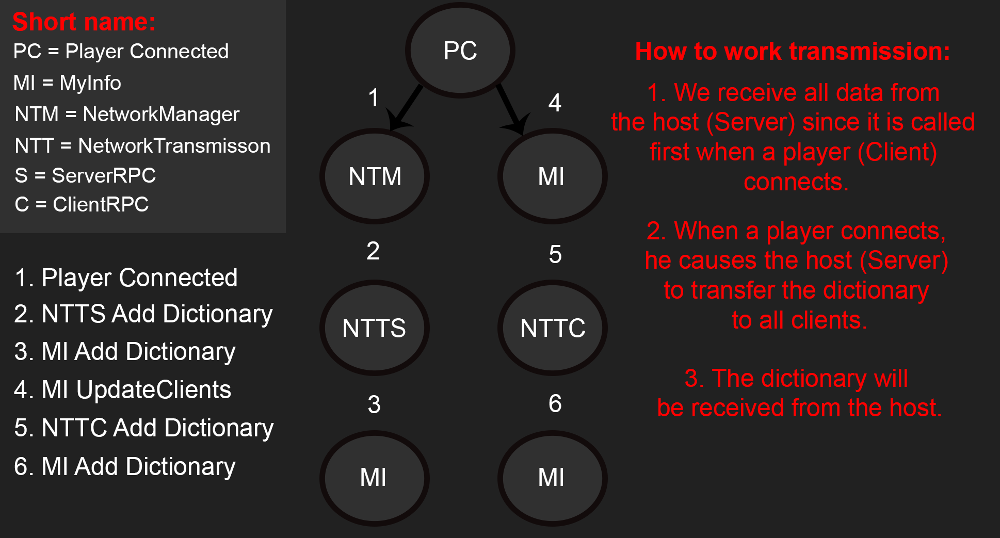

# Lobby Netcode Facepunch


This is a lobby template for Netcode Facepunch. Scripts and their descriptions will be found here. The scripts are not perfect and you may encounter errors.

- Netcode for GameObject
- Multiplayer Tools
- Facepunch Transport for Netcode for GameObject
- NaughtyAttributes

## Assets Package
If you will use scripts in the project, install packages:
How to install the package: Open Unity -> Window -> Package Manager
| Plugin | Version | Link | 
| ------ | ------ | ------ |
| NetCode For GameObject | 1.2.0 |Unity Registry| 
| Multiplayer Tools | 1.1.1 |Unity Registry|
| Facepunch Transport for Netcode for GameObject | 2.0.0 | [GitHub](https://github.com/UnityMark/Netcode-Facepunch-UnityLobby/blob/main/multiplayer-community-contributions-main.rar) |
| NaughtyAttributes |  |[GitHub](https://github.com/dbrizov/NaughtyAttributes) or  [Asset Store](https://assetstore.unity.com/packages/tools/utilities/naughtyattributes-129996)|

To install packages that are in the Unity registry: Open Unity -> Window -> Package Manager -> (Change My Assets to Unity Registry)

To install "Facepunch Transport for Netcode for GameObject", download the repository. To install packages from disk:
1. Unpack the archive.
2. Open Unity -> Window -> Package Manager -> Plus (Figure) -> Add package from disk.
3. Select the file path: multiplayer-community-contributions-main\Transports\com.community.netcode.transport.facepunch\package.json.

# Information on how the lobby works
### NetworkTransmission.cs
**NetworkTransmission.cs** -> This is the transfer of data between the server and clients. Synchronizes the client and server.
It works on the principle from Server to Clients. When the Client connects, it calls the Server method when connecting, thereby data will be taken from the Server and transmitted to clients.
The picture shows how it works and how methods are called:




**GameNetworkManager.cs** -> is manager for Netcode Facepunch. 

Functions:
- Creating a lobby
- Connection to the lobby upon steam request
- Connect to the lobby by ID
- Disconnect from the lobby

**Methods that call ServerRPC in GameNetworkManager.cs.**

***Host Calling:***
```C#
private void OnLobbyCreated(Result result, Lobby lobby)
{
    NetworkTransmission.instance.AddMeToDictionaryPlayerServerRPC(SteamClient.SteamId, SteamClient.Name, NetworkManager.Singleton.LocalClientId);
}
```
***Client Calling:***
```C#
private void OnClientConnectedCallback(ulong clientId)
{
    NetworkTransmission.instance.AddMeToDictionaryPlayerServerRPC(SteamClient.SteamId, SteamClient.Name, clientId);
}
```

**NetworkTransmission.cs - ServerRPC method**

Functions:
- Sync data server and client

Attribute [ServerRpc(RequireOwnership = false)] - allows clients to call a server-side method. 

This method is called when players connect from the server side. First the player is added from the server side, then the server forces the client to update the players based on its data. All clients receive data from the server.

***Method for add client to dictionary:***
```C#
[ServerRpc(RequireOwnership = false)]
public void AddMeToDictionaryPlayerServerRPC(ulong steamId, string steamName, ulong clientId)
{
    MyInfo.instance.AddPlayerToDictionary(steamId, steamName, clientId);
    MyInfo.instance.UpdateClientsDictionary();
}
```
**MyInfo.cs - AddPlayerToDictionary && UpdateClientsDictionary**

Functions: 
- Save Data for game and lobby.

This adds the player to the dictionary and creates a gameObject with some data about the player that is needed in the lobby and game.

```C#
public void AddPlayerToDictionary(ulong steamId, string steamName, ulong clientId)
{
    if (!PlayerInformation.ContainsKey(clientId))
    {
        PlayerInfo pi = Instantiate(MenuManager.instance.GetPlayerCardPrefab(), MenuManager.instance.GetPlayerFieldBox().transform).GetComponent<PlayerInfo>();
        pi.SteamID = steamId;
        pi.SteanName = steamName;
        PlayerInformation.Add(clientId, pi.gameObject);
    }
}
```

This method creates missing players based on Server data for Clients.

```C#
public void UpdateClientsDictionary()
{
    foreach (KeyValuePair<ulong, GameObject> player in MyInfo.instance.PlayerInformation)
    {
        ulong steamId = player.Value.GetComponent<PlayerInfo>().SteamID;
        string steamName = player.Value.GetComponent<PlayerInfo>().SteanName;
        ulong clientId = player.Key;

        NetworkTransmission.instance.UpdateClientsPlayerInfromationClientRpc(steamId, steamName, clientId);
    }
}
```

**NetworkTransmission.cs - ClientRPC method**

Creates objects with information about players for clients.

```C#
[ClientRpc]
public void UpdateClientsPlayerInfromationClientRpc(ulong steamId, string steamName, ulong clientId)
{
    MyInfo.instance.AddPlayerToDictionary(steamId, steamName, clientId);
}
```


